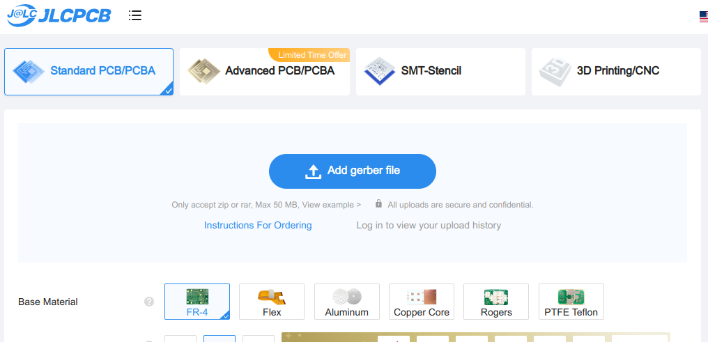
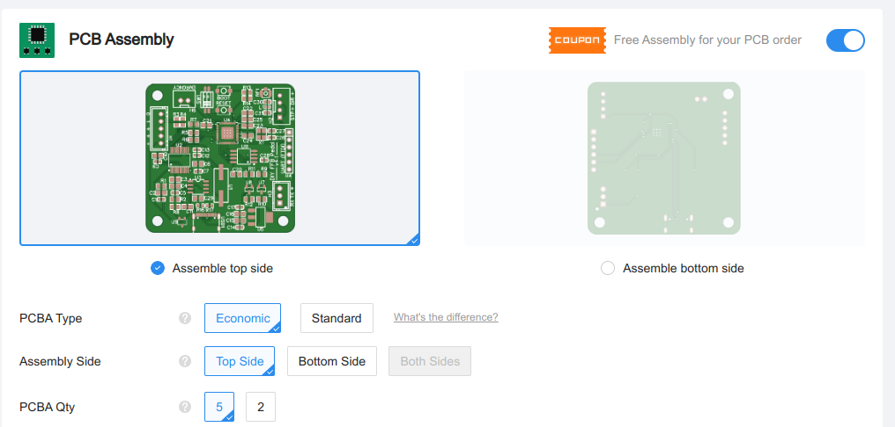
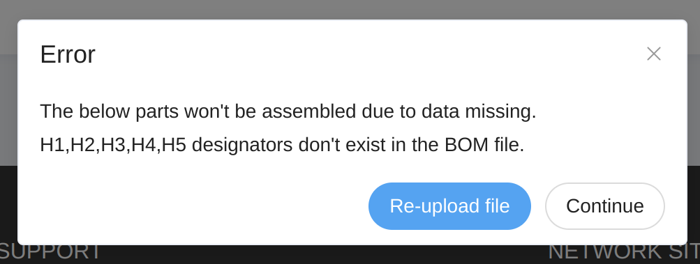
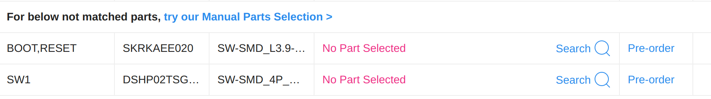

# DIY-Sim-Racing-FFB-Pedal-PCBs
This repository contains my PCB Designs for ChrGri/DIY-Sim-Racing-FFB-Pedal

These PCB designs are custom-built for the [DIY Force Feedback Pedal](https://github.com/ChrGri/DIY-Sim-Racing-FFB-Pedal), and probably aren't really useful for anything else. Most of the boards are designed to be bought fully assembled by a PCBA company - my files should all work at JLCPCB. The power PCB you could probably assemble by hand if you have the equipment, but don't even try with the others.

This repository contains files for the fully-assembled PCBs for the DIY project including the control and power boards.

### Control board
The [ESP32-S3-based pedal control board](control-board/readme.md) is the brains of the pedal, offering USB and wireless connections

### Power board
The [power board](power-board/readme.md) provides protection for the iSV57T servo and 5V power for the control board

## Ordering assembled PCBs
You can buy plain boards and assemble them yourself if you're a massachist. I've done it myself but I don't recommend it. Placing some of the devices, especially the ESP32-S3 IC are very tricky due to their size and how close the pins are. Only do this if you're really sure you can do it right! For most mortals, get the PCB assembled professionaly by a robot that's better at this than we are.

1. Download the gerber, BOM and pick-and-place files. These are what you need to order the PCBs fully assembled from JLCPCB.
2. Head over to [JLCPCB](https://jlcpcb.com/quote) and click on "Add gerber file" and select the gerber zip file you downloaded from this repo
You can select the number of PCBs to order. The miniumum is 5, then it's increments of 5. If you want to change the color of the PCB, now's the time! JLCPCB offers green, purple, yellow, black, blue, red and white. If you don't change anything, you'll get green (the fastest).

3. The website will process the file and you should see the PCB appear. Scroll down to `PCB Assembly` and enable the option. Then make sure you get the number of boards you want to have assembled. You can get all 5 if you need. If you need fewer, you can also order two. It's cheapest when you order in bulk, so you can always ask in the Discord channel if lots of people want to buy, because then it's cheaper (although someone has to ship them all out!)

Now click `Next`. You will need to sign in or create an account to continue.
4. You'll see a picture of the PCB (step 1). Just click `Next`, there's nothing to do here.
5. Next you'll need to upload the BOM and pick-and-place files you downloaded. Click on the `Process` button
You might see a warning at this point for some of the boards. Don't panic! That's normal, just press on "Continue"

6. The next screen will show you all the parts in the BOM and confirm the quantity of each. If stock is low or there isn't any stock of some parts then you will be notified. You will need to find a compatible part. Feel free to ask on the PCBA channel on the Discord server if you don't know how to find a part. Don't use the recommended replacements in the window, they're often the wrong size!
**Note**
For some reason JLCPCB seems have issues with two parts on the control board, so you might see this:

Click on "Search" then click on "Select" for the only line item.

Click `Next`
7. Finally, you will be given a summary and you can click `Save to cart`. Now it's like checking out anywhere else, you don't need my help for that!

## What does "assembled" mean?
It means you don't need to solder any components onto the board! However, you are responsible for (doing a good job) soldering any connectors you want to use onto the boards. Boards will ship without pin connectors, unless you modify your order with JLCPCB. You can use:
- [JST-XH connectors](https://www.aliexpress.us/item/4000120545240.html) a standard connector widely used in electronics, in fact they're in the iSV Servo
- [Screw terminals](https://www.aliexpress.us/item/1005001677869988.html) an easy way to connect that just uses bare wire, but are bulkier
- [Pin headers](https://www.aliexpress.us/item/1005001514058091.html) not generally recommended as they're unreliable
- Solder wire straight to the board

## Questions?
Come ask on [the PCBA channel on the Discord server](https://discordapp.com/channels/1113129142142120159/1269625529334628373).