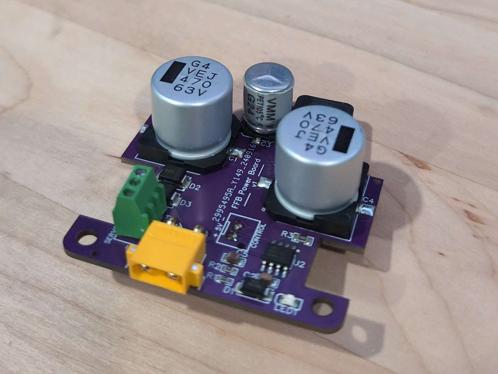
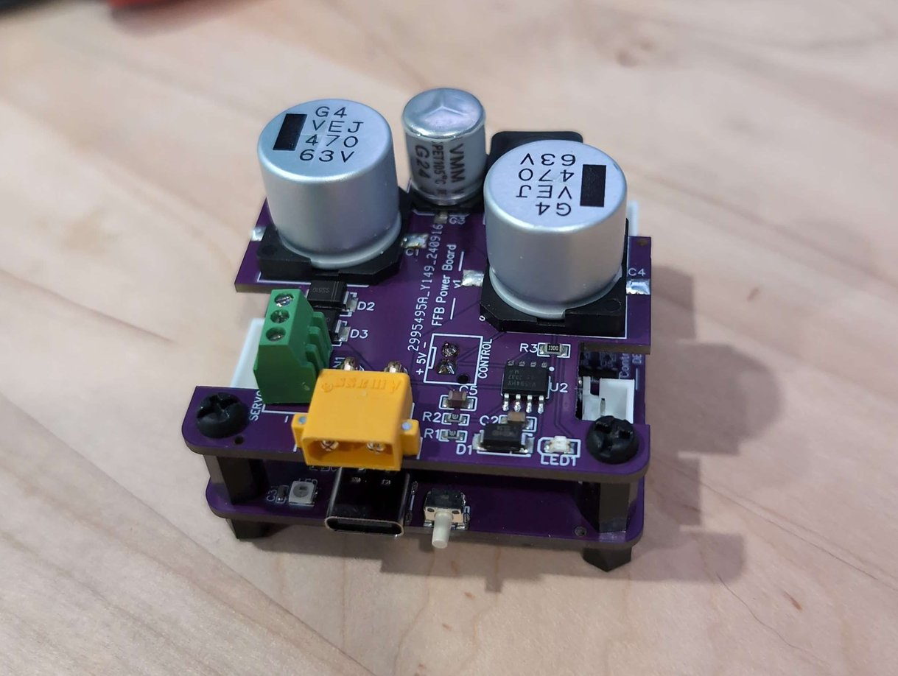
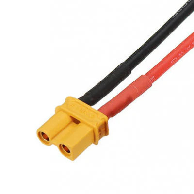

# Pedal power board

This is the power board that matches the [FFB pedal control board](../control-board) and is designed to stack with the control board for a compact footprint. With a built-in 1 second delay, the board allows the servo to power on before the control board starts, preventing the servo from entering an alarm condition. This board is ideal for a wireless setup as the control board is powered from the same PSU as the servo.
 
 

 
 
## Features
- Protection circuit for the iSV57T servo
- Same footprint as the control board
- 5V switching regulator can provide a power line to the power board
- Optionally stackable with the control board
- Power LED (connected to 5V power line)
- 2.54mm spacing for servo and 5V (JST-XH / DuPont / Screw Terminal)
- ~1s delay allows iSV57T servo to start before the control board
- XT30 power input connector

> [!WARNING]
> Ensure the polarity of the power connectors is correct! If you wire the XT30 connector backwards, you **will** do irreprable damage to the board.

## Connector selection
The board will ship with an XT30 connector for power input, but the control board power connector and servo output power connectors will not be populated.
- Connectors for the control board power
  - When stacking, 2.54mm female DuPont headers work well, soldered to the **bottom of the PCB** 
  - If not stacking, any 2.54mm-spaced connector will work (screw terminals or JST-XH recommended)
- Connectors for the servo power output. Almost any 2.54mm-spaced connector will work, but be aware of the power output and ensure your connector is capable. Screw terminals are recommended (pictured)
- Input power cable with [XT30 connectors](https://www.amazon.com/Connectors-Female-Pieces-Shrink-Battery/dp/B0875MBLNH) from the PSU
XT30 power connectors

## Power plug polarity
The XT30 power connector has defined polarity. Make sure you follow it! **You will damage the board if you connect it backwards**. The square side of the power connector is positive (+) and the rounded size is ground (-).

## To stack the boards
You will need [2.5mm standoffs](https://www.amazon.com/COMRUN-M2-5-Standoff-Assortment-Motherboard/dp/B0CKBWQSNY) for stacking the board. The gap between the boards will be 11mm when using standard pin headers between the boards. Using 10mm stand-offs works well. You can either remove the plastic spacer from the male pin header on the control board, or add a screw to the 10mm spacer for a 12mm gap.