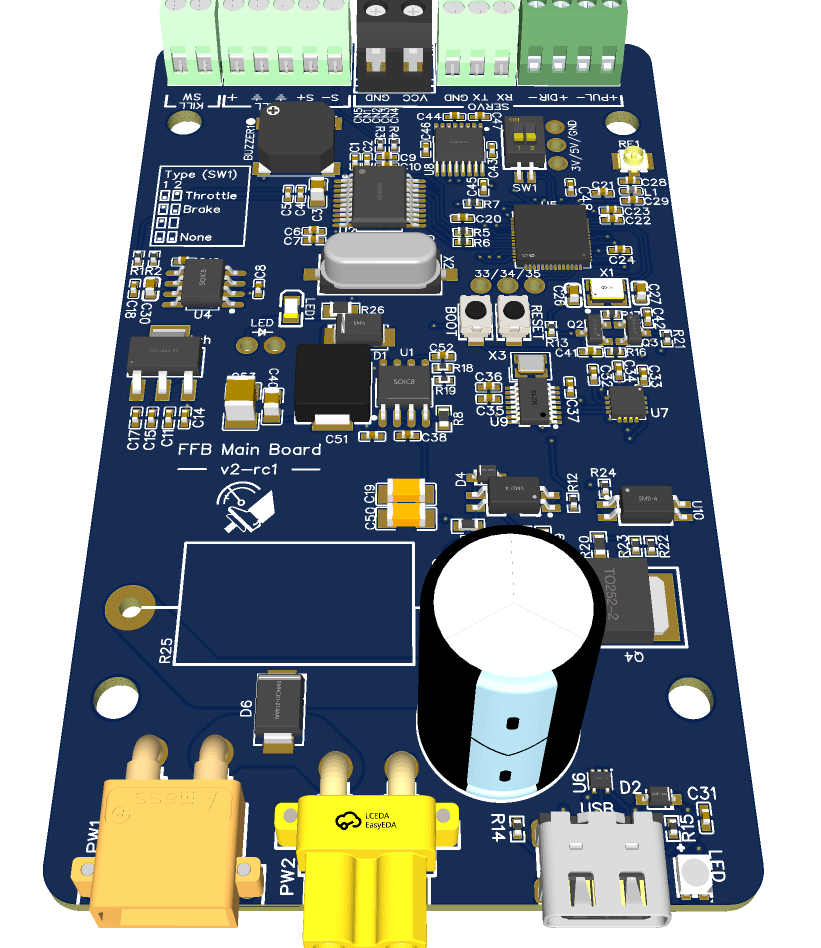

# Pedal control board

## Background
The v2 board is an updated, integrated version of the previous "stacking" v1 design that brings all components onto a single board. It's a more compact design, since it's a single board and it's also cheaper to purchase (compared with a control + power board for the v1 design). The design goals are the same as the v1 board, although the v2 board has some new features that are not available in the v1 form factor.

 

 > [!NOTE]
 > Unlike the v1 board, the v2 board design includes a brake resistor. This resistor cannot be installed during assembly and must be sourced separately and hand soldered to the board.

## Features
- Compact size! 91mm x 51mm. The design is thin, so will fit under most pedal designs [new for v2]
- ESP32-S3 based for reliability
- Servo control circuit [FUTURE]. This allows power control of the servo, switching the servo off while the pedal is not in use, and waking it again when you touch the pedal. This feature is not yet implemented. [new for v2]
- Dedicated channels for USB-HID and serial when used in USB connect mode [new for v2]
- Dedicated connections for loadcell, servo serial, servo signal, an emergency cut-off button
- DIP switches to select the pedal type when using the wireless bridge (Accelerator, Brake or Clutch)
- All headers, except servo power, are 2.54mm, meaning you can select your connection type: screw terminals (recommnended for new builds), or soldering straight to the board. DuPont connectors are not recommended. The V2 board does not support the JST-XH included on the V1 board. If you are moving from a V1 board, you will need to cut off the connectors and wire them into the screw terminals
- RS232 interface chip for more reliable connection to the servo [new for v2]
- Built in buzzer [new for v2]
- Brake resistor circuit [new for v2]
- Fimware upgrades are handled automatically, no need to press the BOOT button [new for v2]
- Fully compatible with mainline release builds, you don't need any special firmware builds to use this PCB
- If you want to use the wireless connection, an u.fl/IPEX connector is included for an external antenna (useful if you pedal is aluminum)
- USB-C connector for power and data
- For wireless (recommended) only a single power connection is required
- LED for troubleshooting
- Optional capacitor for extreme braking use [not normally required]
- GPIO 33/34/35 are broken out on the PCB for extensibility [new for v2]
- All connectors are at the end of the board for simple connetivity [new for v2]
- Extra protection diode and larger footprint capacitor for easier ordering (GA)

*As of the time of writing, USB-HID support is experimental and may be unreliable. This board also has a IPEX header for wireless communication to the wireless setup or you can use vJoy.

## Do I need anything special for this board?
Unlke the v1 board, the v2 board requires a aluminum wirewound resistor that *you will need to buy and solder yourself*. This component is not optional. A 5W, 5Ohm resistor is recommended. [this one on Amazon](https://www.amazon.com/dp/B07FF2QYFX?ref_=ppx_hzsearch_conn_dt_b_fed_asin_title_1) is the recommended one.

If you're going to be using the wireless connection you'll need an antenna for the board. I use the flexible internal type but you can use anything that has an IPEX 1 connector. I use [this one](https://www.amazon.com/Antenna-2-4GHz-Internal-Laptop-Module/dp/B0CQCBHMDS/ref=sr_1_3?sr=8-3)

## That big capacitor, C25, is really big. Do I need it?
No, the capacitor is currently optional and should only be required for users who set their braking force extremely high. Most users will not require it. Most users can deselect the component when ordering the board, which also keeps the height of the board down. It can always be added later by hand if required.

## A quick note on connectors
Unlike the v1 board, the v2 board will ship with screw terminals installed. You will need to manually swap the connectors while ordering, or deselect them and hand solder different connectors if you don't want to use the screw terminals. Honestly, their the easiest and least error-prone to use.

## Assign a function
Before you begin, you must assign a function to the pedal: throttle, brake or clutch. This is done with SW1. You will find instructions on the  board but they're here for reference:

## Flashing the board for the first time
Flashing the board is largely the same as any other device, but there are a few quirks. So read before flashing!
1. Start with the board unplugged
2. Check the names of the serial ports on your PC (if any)
3. While holding down the "Flash" button ("Boot" on older boards), plug the board in to your PC
4. A new serial port (COM port) will appear on your PC, note which one it is
5. Now you can follow the instuctions from the main Wiki, just make sure you flash the `-gilphilbert` flash image
6. When you've flashed all the images (with the correct offsets!) press reset, or simply unplug the board from your PC and plug it back in
